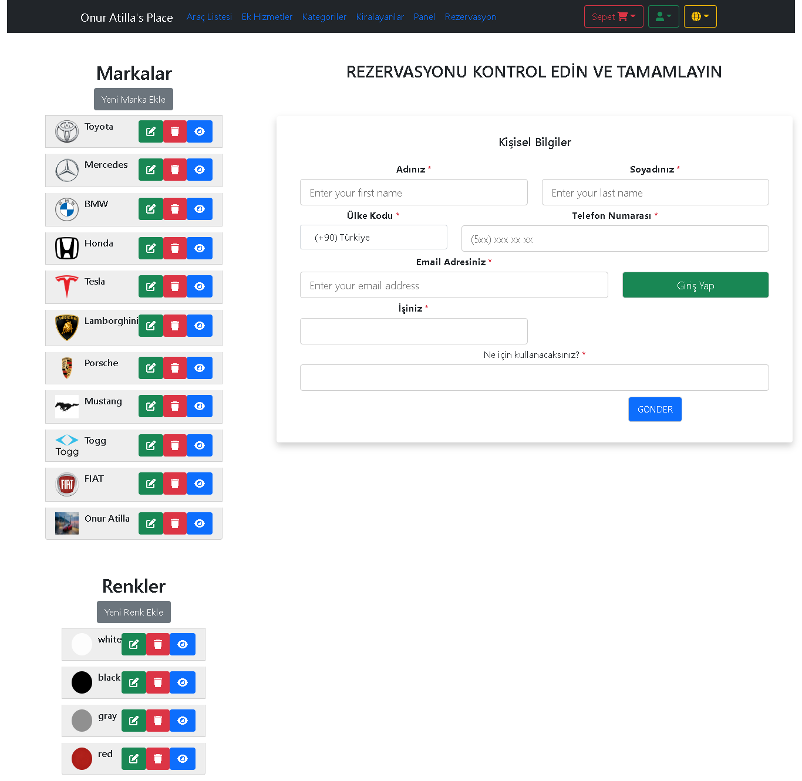

# _Araç Kiralama Portalı Projesi_

- ✨Angular✨
- HTML
- CSS
- JavaScript
- TypeScript

## İçerik Hakkında
- CRUD işlemleri gerçekleştirildi.
- Sepete ekleme, silme ve sepet görüntüleme yapıldı.
- JSON API kullanarak kendi apimizi oluşturduk.
- Reactive Form kullandık.

#### Çalıştırmak için Gerekli İşlemler
- `npm i` komutu uygulayarak node_modules klasörünü ekleyeblirsiniz.

- `npm install -g json-server` komutu ile JSON-Server kurulur.

- `json-server --watch db.json` komutu ile Json-Server Başlatılır.

- `npm install -g firebase-tools` komutu ile Firebase kurulur.

- `ng add @angular/fire` komutu ile Authentication, Firestore Database, Cloud Storage kurulur.

## Site İçi Görüntüler

## Veritabanı Tablosu

